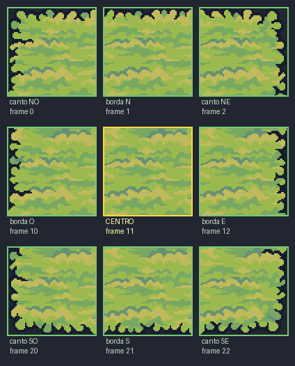

# Como funciona o encaixe dos tiles (autotiling)

Guia para desenhar mapas neste projeto. Explica por que os tiles se conectam
perfeitamente, quantas sprites cada bioma usa, e como pintar um bioma novo.
Exemplo principal: a **grama do bioma CAMPO**.

> TL;DR — cada bioma é um **retângulo** pintado com um **bloco de 9 sprites (3×3)**:
> 4 cantos + 4 bordas + 1 centro. A sprite certa de cada célula é escolhida pela
> posição dela na borda (primeira/última linha ou coluna → borda; senão → centro).

---

## 1. A ideia central: um bloco 3×3 por bioma

Uma ilha/bioma é um retângulo de células (ex.: CAMPO = 10×9 tiles). Cada célula
recebe **uma** das 9 sprites de um "bloco 3×3", dependendo de onde ela está:

```
   coluna →   oeste(0)   meio(1)   leste(2)
 linha
 norte(0)      ┌──────┐  ┌──────┐  ┌──────┐
               │canto │  │borda │  │canto │
               │  NO  │  │  N   │  │  NE  │
               └──────┘  └──────┘  └──────┘
 meio(1)       ┌──────┐  ┌──────┐  ┌──────┐
               │borda │  │      │  │borda │
               │  O   │  │CENTRO│  │  E   │
               └──────┘  └──────┘  └──────┘
 sul(2)        ┌──────┐  ┌──────┐  ┌──────┐
               │canto │  │borda │  │canto │
               │  SO  │  │  S   │  │  SE  │
               └──────┘  └──────┘  └──────┘
```

- **4 sprites de canto** (NO, NE, SO, SE) — têm a borda desenhada em **dois** lados.
- **4 sprites de borda** (N, S, O, E) — têm a borda desenhada em **um** lado.
- **1 sprite de centro** — grama pura, sem borda; é a única que se **repete** (preenche
  todo o miolo).

**Total: 9 sprites cobrem qualquer retângulo, de qualquer tamanho.** O miolo inteiro
é só o tile de centro repetido; as 8 sprites de moldura fecham as beiradas.

Por isso o desenho "conecta": as bordas foram desenhadas pela artista já pensando em
emendar — o lado direito do canto-NO encaixa no tile-borda-N, que encaixa no canto-NE,
e assim por diante. O motor só precisa escolher a peça certa para cada célula.

---

## 2. O atlas da grama (`terrain/campo_deserto.png`)

Arquivo real: **640×256 px = 10 colunas × 4 linhas = 40 frames de 64 px**
(é o `Tilemap_Flat` do pack Tiny Swords). Contém DOIS blocos:

- **Grama** nas colunas 0–2 (`base = 0`)
- **Areia** nas colunas 5–7 (`base = 5`) — mesmo layout, deslocado 5 colunas

Numeração de frame do Phaser: `frame = linha × 10 + coluna` (10 = nº de colunas do PNG).

### Os 9 frames da grama (bloco em base 0)

| Frame | Linha,Col | Função        | O que desenha                    |
|:-----:|:---------:|---------------|----------------------------------|
| **0**  | 0,0 | canto Noroeste | borda em cima **e** à esquerda   |
| **1**  | 0,1 | borda Norte    | borda só em cima                 |
| **2**  | 0,2 | canto Nordeste | borda em cima **e** à direita    |
| **10** | 1,0 | borda Oeste    | borda só à esquerda              |
| **11** | 1,1 | **CENTRO**     | grama cheia, sem borda (repete)  |
| **12** | 1,2 | borda Leste    | borda só à direita               |
| **20** | 2,0 | canto Sudoeste | borda embaixo **e** à esquerda   |
| **21** | 2,1 | borda Sul      | borda só embaixo (franja de grama)|
| **22** | 2,2 | canto Sudeste  | borda embaixo **e** à direita    |

Resumo pedido:
- **Sprites de borda da grama: 8** (4 cantos + 4 lados).
- **Sprites de centro da grama: 1** (frame 11) — é a que se repete no miolo.
- **Total por bioma: 9.**

Diagrama visual dos 9 tiles (repare a borda escura em cada peça vs o centro liso):



Atlas completo com todos os índices (grama 0–2, areia 5–7): `img/tiles_atlas_campo.png`.

> A linha 3 do PNG (frames 30–33) e a coluna 3 (frames 3,13,23,33) são variações
> extras que este motor **não usa** (ex.: coluna de 1 tile de largura). Ignore-as.

Para a **areia** é idêntico, somando 5: cantos 5/7/25/27, bordas 6/15/17/26, centro 16.

---

## 3. O código que pinta (`paintRect` em `demo64/game.js`)

```js
function paintRect(scene, rect, base, depth, tex = 'flat') {
  for (let y = 0; y < rect.h; y++) for (let x = 0; x < rect.w; x++) {
    // coluna do bloco: 0=oeste na 1ª col, 2=leste na última, senão 1=meio
    const c = x === 0 ? 0 : (x === rect.w - 1 ? 2 : 1);
    // linha do bloco: 0=norte na 1ª linha, 2=sul na última, senão 1=meio
    const r = y === 0 ? 0 : (y === rect.h - 1 ? 2 : 1);
    scene.add.image((rect.x + x) * 64, (rect.y + y) * 64, tex, base + r * 10 + c)
      .setOrigin(0).setDepth(depth);
  }
}
```

Lê-se assim, para cada célula do retângulo:
1. **Qual coluna do bloco?** primeira coluna → 0 (oeste), última → 2 (leste), senão → 1 (meio).
2. **Qual linha do bloco?** primeira linha → 0 (norte), última → 2 (sul), senão → 1 (meio).
3. **Frame final** = `base + linha×10 + coluna`. Ex.: célula do canto inferior-esquerdo
   da grama = `0 + 2×10 + 0 = 20`. Centro = `0 + 1×10 + 1 = 11`.

Chamadas reais:
```js
paintRect(this, ISLES.campo,   0, -80);            // grama  (base 0)
paintRect(this, ISLES.deserto, 5, -80);            // areia  (base 5, mesmo atlas)
paintRect(this, ISLES.neve,    0, -80, 'snowflat');// neve   (base 0, atlas recolorido)
```

`depth: -80` mantém o chão atrás de tudo (personagens usam `depth = y` para sobrepor).

---

## 4. A água e a animação da borda (a "água batendo")

Duas camadas, desenhadas ANTES dos biomas:

**a) Água de fundo** — um único `tileSprite` de `terrain/water.png` (64×64) cobrindo o
mundo inteiro, em `depth = -100` (atrás de tudo). É estático e barato.

**b) Espuma animada** — `terrain/foam.png` = **1536×192 = 8 frames de 192×192**. É um
sprite ANIMADO desenhado **só no anel externo** de cada ilha (a moldura de 1 célula):

```js
this.anims.create({ key: 'foam', frameRate: 9, repeat: -1,
  frames: this.anims.generateFrameNumbers('foam', { start: 0, end: 7 }) });

function foamRing(scene, rect) {
  for (let y = 0; y < rect.h; y++) for (let x = 0; x < rect.w; x++) {
    if (y === 0 || x === 0 || y === rect.h - 1 || x === rect.w - 1) {  // só a borda
      scene.add.sprite((rect.x + x) * 64 + 32, (rect.y + y) * 64 + 32, 'foam')
        .setDepth(-90)
        .play({ key: 'foam', startFrame: (x + y) % 8 });   // ← truque da onda
    }
  }
}
```

O truque de qualidade: **`startFrame: (x + y) % 8`** desencontra a fase de cada tile de
espuma. Sem isso, o anel inteiro piscaria em uníssono (feio); com isso, a onda parece
se **propagar** ao redor da ilha. A espuma fica em `depth -90` (sobre a água -100, sob
o chão -80). O mesmo `foamRing` serve todos os biomas — a espuma é neutra.

Ordem de desenho de um bioma:
```
water (tileSprite, -100)  →  foamRing (anel, -90)  →  paintRect (chão, -80)  →  props/personagens (depth = y)
```

---

## 5. Variações do mesmo padrão

- **Areia (deserto):** exatamente o mesmo bloco 3×3, `base = 5`. Zero código novo.
- **Neve:** `terrain/neve.png` é o atlas da grama **recolorido** (palette swap) — mesma
  estrutura de frames, então usa o mesmo `paintRect` com `tex = 'snowflat'`.
- **Pedra (elevation):** `terrain/pedra.png` (256×512 = 4×8 frames). Usa `paintStone`,
  que é o mesmo bloco 3×3 das linhas 0–2 **mais** uma linha 3 (frames 12–14) desenhada
  UMA célula ABAIXO da ilha como "face de penhasco", com espuma na base — dá a sensação
  de platô elevado. Colunas: 0=oeste, 2=leste, 1=meio; frame = `linha×4 + coluna`.

---

## 6. Receita: adicionar um bioma novo (para o outro agente)

1. **Precisa de um atlas** com o bloco 3×3 (9 tiles) do terreno. Se for um pack Tiny
   Swords, já vem pronto (grama/areia num PNG, pedra noutro). Se for terreno novo,
   ou desenhe as 9 peças, ou **recolora** um atlas existente (como a neve).
2. **Defina o retângulo** em `ISLES`: `{ x, y, w, h, base, titulo }` (posição em tiles).
3. **Pinte:** `foamRing(this, ISLES.novo)` + `paintRect(this, ISLES.novo, base, -80, 'tex')`.
4. **Ligue com ponte** se quiser: adicione as células a `BRIDGES` (linha horizontal de
   `bridge.png`, 3 segmentos: esquerda=0, meio=1, direita=2).
5. **Colisão:** `walkableBase` já deixa andar em qualquer célula de ilha ou ponte e
   bloqueia água. Árvores/prédios entram no Set `blocked`.

### Limitação importante (leia antes de desenhar)

Este método **só faz retângulos**. O miolo é 1 tile repetido, a moldura são 8 tiles.
Funciona porque toda ilha aqui é retangular.

Para **formas orgânicas** (ilha com curvas, lago no meio, terreno que serpenteia) 9
tiles não bastam — aí é preciso um **tileset Wang / dual-grid**: cada tile define seus
4 cantos (terreno A ou B) e você escolhe o tile pela combinação dos 4 cantos vizinhos
(16 tiles). Foi assim que integramos o tileset de neve gerado por IA (ver
`_source/ai_gen/snow/` — arquivos nomeados `t_UULU.png` etc., onde U=neve, L=água nos
cantos NW,NE,SW,SE). Para começar, prefira retângulos com o bloco 3×3: é simples,
barato e o resultado (como o CAMPO) fica limpo.
